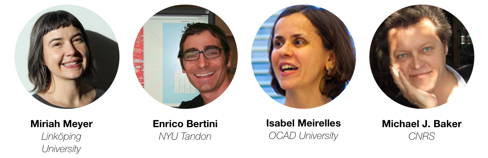

## IEEE VIS Workshop on Data Vis Activities, 2021

# 🎉Vis Activities 🍻🧠📊💡
Visualisation Activities to Facilitate Learning, Reflecting, Discussing, and Designing, will happen during IEEE VIS 2021, the 25th of October 2021 8am CDT, UTC-5.

This workshop on _Data Vis Activities to Facilitate Learning, Reflecting, Discussing, and Designing_ focuses on __data-visualization activities__, especially methods and challenges for teaching and engaging with data visualization concepts, knowledge, and practices. 

❤️ Enjoy your Vis experience ❤️

## Program:

### Session 1 Opening, Keynote, Papers (8:00 - 9:30)

##### 8:00 __Introduction to the Workshop__

##### 8:15-8:45 __Keynote by Wesley Willett: Encouraging Engagement, Practice, & Creativity in Vis Teaching (at a Distance)__

##### 8:45-9:30 __Paper session introduction, Mandy Keck__

* _Ligthning talk:_ Personal data collection and "experiential mapping" pre- and post-pandemic. Curt Lund, Digital Media Arts - _Hamline University_ (2 min) 
* _Ligthning talk:_ A workshop to teach the fundamentals of usability testing. Roshni Gohil - _MIT_. [(abstract)](papers/Abstract-Gohil-UsabilityTestingDataVisualizations.pdf) (2min)
* [Learning Cues to Improve the Understanding of Explanatory Storytelling](papers/1154_Alark_Joshi.pdf). Alark Joshi - _Department of Computer Science University of San Francisco_ (5min, 2min Q&A)
* [Teaching K-12 Classrooms Data Programming: A Three-Week Workshop with Online and Unplugged Activities](papers/1355_Alpay_Sabuncuoglo.pdf). Alpay Sabuncuoğlu, Asim Evren Yantac, T. Metin Sezgin - _Department of Computer Engineering, Koç University_ (5min, 2min Q&A)
* [Experience of Teaching Data Visualization using Project-based Learning](papers/6705_Dietrich_Kammer.pdf). Dietrich Kammer, Elena Stoll, Adam Urban - _Faculty of Informatics / Mathematics, University of Applied Sciences Dresden_ (5min, 2min Q&A)
* [DataBlokken: Stimulating Critical Data Literacy of Children Through the Use of a Life-size Data Physicalisation Game](papers/8933_Paola_Verhaert.pdf). Paola Verhaert, Georgia Panagiotidou, Andew Vande Moere - _KU Leuven, Belgium_ (5min, 2min Q&A)

### Session 2 Panel Discussion and Challenges (10:00 - 11:30)

##### 10:00 __Session opening, Samuel Huron__ 
##### 10:02-10:22 __Panelist Presentations__ 

* _[Miriah Meyer](https://miriah.github.io/)_ - [@miriah_meyer](https://twitter.com/miriah_meyer) - “Participatory Visualization Workshops”,
* _[Michael Baker](https://scholar.google.com/citations?user=PimAOhsAAAAJ&hl=fr)_  “Diagrammatic representations of argument in CABLE (Collaborative Argumentation-Based Learning)” 
* _[Isabelle Meireilles](https://www2.ocadu.ca/bio/isabel-meirelles-0)_ - “Contextualizing Data in Situ”
* _[Enrico Bertini](http://enrico.bertini.io/)_ - [@FILWD](https://twitter.com/filwd) - "Active Data Visualization Learning with Mini-Projects"

##### 10:22-11:25 __Panel Discussion & Challenge identification__

### Session 3 ⚽️ Activity Generation Session (12:00 - 13:30)
##### 12:00-12:20 __Session opening__
##### 12:20-13:15	__Group work : Creating an activity!__
##### 13:15-13:30	__Group work : Wrap up__ 

### Session 4 📝 Establishing a Research Agenda (14:00 - 15:30)
##### 14:00-14:05	__Session opening__ 
##### 14:05-14:35	__Reporting on generated activities__
##### 14:35-15:05	__Setting the agenda & community building__ 
##### 15:05-15:30	__Wrap-up discussion__ 

## Topics & Goals:
Workshops, classes, or collaborations with domain experts often include hands-on data visualization activities that involve analog or digital tools and materials as well as more or less well-defined protocols. Recent years have seen the emergence of such data visualization activities in different contexts, including education, visualization design, activism, self-reflection, and interdisciplinary collaboration: for example, sketching aids designers to consider alternative ideas; manipulating tokens help students conceptualize quantities for data visualization; user interviews and discussions help developers understand requirements manipulating data help activist better understand social issues, etc.

While many of these activities would naturally take place in a group setting, due to **the social distancing measures during the Covid-19 more and more of these activities are now happening online.** Switching from co-located and synchronous activities to remote and sometimes asynchronous activities, changed the way we teach or design data visualization. This required teachers and designers to reinvent activities, adapt materials to be suitable for online delivery, reorganise procedures, replace physical tools with virtual, rethink collaboration and engagement, restructure or invent new activities. At the same time, moving activities online opens new possibilities to involve people across the world and in turn increase diversity and access.

**The goals of this workshop are:**
Building an understanding and to synthesize protocols and materials used to lead data vis activities (online and offline), to bring together researchers, practitioners, and educators from within and outside of the visualization community, brainstorm, design, experience, and try novel activities, and to discuss issues around goals, methods, audiences, materials, and evaluation for teaching data visualization. And also exchanges about the best teaching moment of the year.
Download our [full proposal here](VIS2021_Vis_Activity_Workshop.pdf).

## Program Committee:

* Lyn Bartram, Simon Fraser University, Canada
* Anastasia Bezerianos, Université Paris-Saclay, France
* Rahul Bhargava, Northeastern University, USA
* Sarah Goodwin, Monash University, Australia
* Kyle Hall, Temple University, USA
* Uta Hinrichs, University of StAndrews
* Petra Isenberg, Université Paris-Saclay, France
* Isabel Meirelles, OCAD University, Canada
* Till Nagel, University of Applied Sciences Mannheim, Germany
* Arran Ridley, University of Leeds, UK
* Jon Schwabish, Urban Institute, USA
* Romain Vuillemot, LIRIS, Ecole Centrale de Lyon, France
* Jagoda Walny, University of Calgary, Canada
* Yuri Engelhardt, University of Twente, Netherlands
* Chris headleand, University of Lincoln, USA
* Enrico Bertini, NYU Tandon School of Engineering, USA
* Panagiotis D. Ritsos, Bangor University, UK
* Yalong Yang, Harvard University, USA
* Dietrich Kammer, University of Applied Sciences Dresden, Germany

## Organizers

* [Samuel Huron](https://perso.telecom-paristech.fr/shuron/#!index.md), Telecom Paris, Institut Polytechnique de Paris
* [Benjamin Bach](http://benjbach.me), University of Edinburgh 
* [Georgia Panagiotidou](https://www.kuleuven.be/wieiswie/en/person/00120899), KU Leuven
* [Jonathan C. Roberts](https://www.bangor.ac.uk/computer-science-and-electronic-engineering/staff/jonathan-roberts/en), Bangor University
* [Mandy Keck](http://www.visual-search.org), University of Applied Scienes Upper Austria
* [Sheelagh Carpendale](https://www.cs.sfu.ca/~sheelagh/), Simon Fraser University

